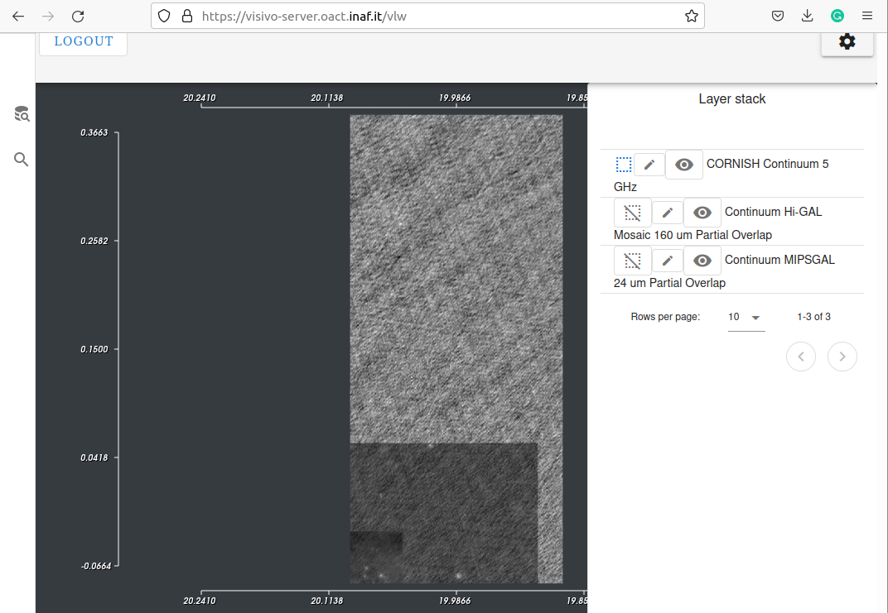
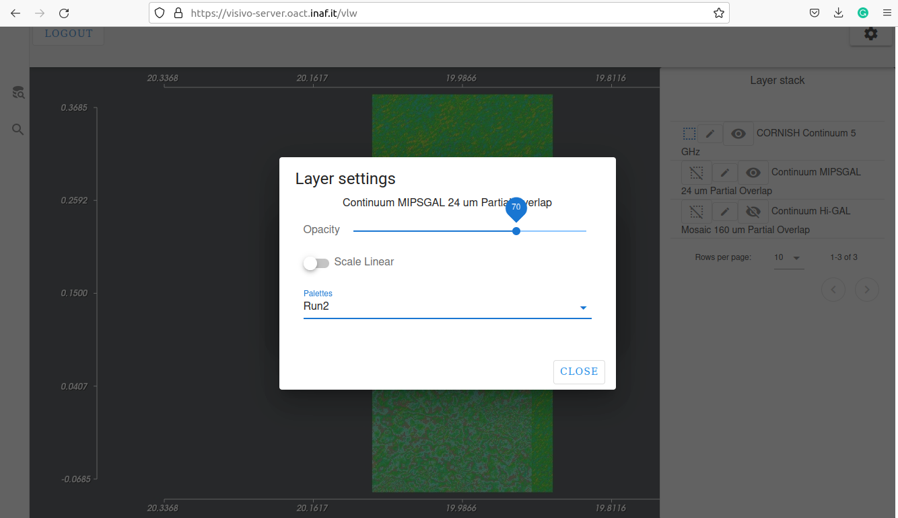

.. _interact-vis-sect:

2D image interactive Visualization
==================================

Adding new 2D images and changing order
---------------------------------------

By clicking on 2D surveys in query results in the right panel, the user add additional images for current visual analysis. The list of all currently visualised images is available at LayerStack (:numref:`layerstackfig`). The user can change the order of images by dragging them into chosen position in Layer Stack list. 

.. _layerstackfig:

   2D images and Layer stack
   
Activating and Hiding/Showing images. 
-------------------------------------
The user can interactively explore  the 2D images.  To adjust the image grayscale with the mouse, the layer should be active. The curently active image (available for mouse interaction) is highlighted with blue square icon in Layer Stack. To activate the 2D image layer, the user should click on its activation icon to turn its picture into blue square.

To hide/show images the user should click on open/closed eye icon next to image layer.

Adjusting opacity and palette of image layer
--------------------------------------------
The user can also adjust the optical parameters of each image in Layers Stack. To adjust opacity and change palette the user should click on "edit" icon next to image layer. This will open a dialog where the user can adjust the opacity and change palette for selected image layer (:numref:`palettefig`).

.. _palettefig:

   Dialog for changing opacity and palette of the selected image layer

