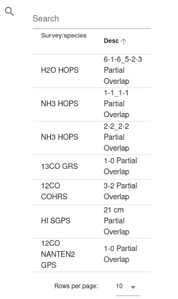

Loading DataCube surveys
========================

To access DataCube surveys data, open a left panel by clicking on a Search icon and enter galactic coordinates (see :numref:`leftpanelfig`)

.. _leftpanelfig:
.. figure:: images/im2.png
   :align: center
   :alt: Right panel

   Right panel

Confirm a VLKB query by clicking on the Query button (see :numref:`leftpanelfig`). Wait till query will be executed and the datacube is loaded.

The first available DataCube data would be loaded and available fo user interaction in 2D and 3D views. All set of datacubes for current VLKB query is available for selection from right panel (see :numref:`surveys-fig`).

.. _surveys-fig:

   The list of available DataCube surveys
