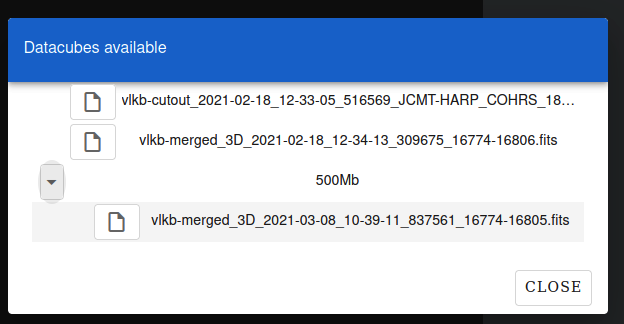

Loading DataCube surveys
========================

To access both 2D and 3D DataCube surveys data,
open a left panel by clicking on a Search icon and enter galactic coordinates (see :numref:`leftpanelfig`), for example glon:20,glat:0,rad:0.2.

.. _leftpanelfig:
.. figure:: images/im2.png
   :align: center
   :alt: Right panel

   Right panel

Confirm a VLKB query by clicking on the Query button (see :numref:`leftpanelfig`). Wait till query will be executed and the first available 2D data is loaded.

In the query results the 2D data is marked as "Continuum" surveys (see :numref:`surveys-fig`). The total number of all available surveys from the query is displayed at the botton. The user can navigate through pages to preview all surveys and adjust the number of surveys displeyed per page, that is 10 by default

.. _surveys-fig:

   The list of available surveys

Multi-tab interface for visualisation of 2D and 3D data
========================================================
Similarly to 2D data, the datacubes for current VLKB query is available for selection from right panel. To visualise the 3D DataCube data, the user should click on selected survey in the query results. The DataCube data would be loaded in a separete web browser tab with available interaction in 2D and 3D views (see :numref:`multitab-fig`).

.. _multitab-fig:

   The selected 2D image and DataCube survey available in different tabs

Browsing and visualising 3D Datacube files (FITS) from the remote server
=====================================================================

VLW also allows browsing and visualising FITS files stored on remote server.
To access local DataCubes, open a left panel by clicking on a Search icon and click on "Load Local" .
The Datacube FITS file browser will appear :numref:`filefig` .

.. _filefig:

   Local FITS file browser
