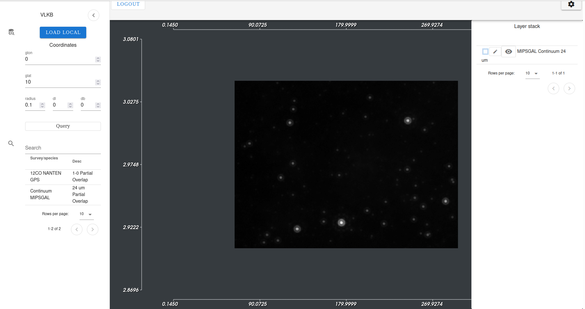

User Interface
==============

After successful login the user is redirected to VLW web page with application main interface. The Web UI is designed as similar as possible to the UI of `ViaLactea desktop version <https://docs.neanias.eu/projects/s1-service/en/latest/services/vialactea.html>`_. The UI components are inspired by the desktop version of ViaLactea but adapted for use within browser and different versions of screen Desktop/Tablet/Mobile.

ViaLactea Web 2.0 provides tools for analysis of 2D and 3D results of VLKB queries. The 2D and 3D data analysis functionality is provided in seperate tabs of a web browser. For testing purposes, the visualisation of local 3D FITS files is also supported. The current interface layout that covers a visualisation of 2D data is presended in :numref:`webfigtwodim` .

.. _webfigtwodim:

   The ViaLactea Web 2D image analysis UI

 The current interface layout that covers a 3D DataCube visualisation aspects is presented in :numref:`webfig` .

.. _webfig:
.. figure:: images/im1.png
   :align: center
   :alt: The ViaLactea Web 3D image analysis UI

   The ViaLactea Web 3D image analysis  UI
