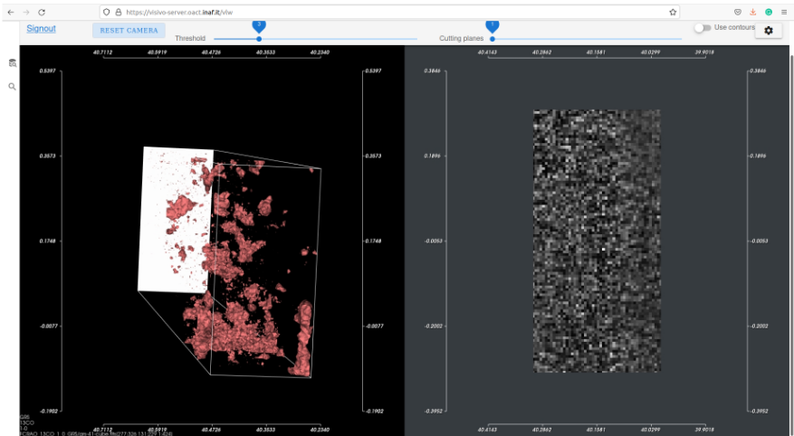

User Interface
==============

After successful login the user is redirected to VLW web page with application main interface. The Web UI is designed as similar as possible to the UI of `ViaLactea desktop version <https://docs.neanias.eu/projects/s1-service/en/latest/services/vialactea.html>`_. The UI components are inspired by the desktop version of ViaLactea but adapted for use within browser and different versions of screen Desktop/Tablet/Mobile. The current interface layout that covers a 3D DataCube visualisation aspects is presented in :numref:`webfig` .

.. _webfig:

Figure 1: The ViaLactea Web UI
